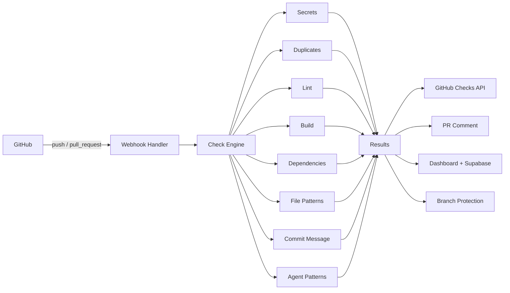

<p align="center">
  
  <h1 align="center">LastGate</h1>
  <p align="center"><strong>AI Agent Commit Guardian</strong></p>
  <p align="center">A pre-flight checklist and gatekeeper for AI-generated code.<br>Intercepts commits from Claude Code, Cursor, Copilot, Devin, and others &mdash; runs safety checks, blocks bad code, and feeds failures back to the agent so it can self-correct.</p>
</p>

<p align="center">
  <a href="https://github.com/AaronCx/LastGate/actions"></a>
  <a href="https://www.npmjs.com/package/lastgate"></a>
  <a href="https://www.typescriptlang.org/"></a>
  <a href="https://bun.sh"></a>
  <a href="LICENSE"></a>
</p>

---

## The Problem

AI coding agents are writing more production code every day. But they ship unchecked work that can:

- **Leak secrets** &mdash; API keys, tokens, and credentials hardcoded in source
- **Break builds** &mdash; type errors, lint failures, missing dependencies
- **Introduce vulnerabilities** &mdash; outdated packages with known CVEs
- **Thrash on problems** &mdash; rewriting the same file repeatedly without progress
- **Ignore conventions** &mdash; skipping tests, bad commit messages, blocked files

## The Solution

LastGate installs as a **GitHub App** on your repos. Every push and pull request triggers a configurable pipeline of safety checks. Failures block the merge via branch protection and are posted as structured PR comments that agents can parse and act on automatically.

Think of it as: **"What if your CI pipeline could talk back to your AI agent?"**

---

## Features

| Check | What It Catches | Severity |
|---|---|---|
| **Secret Scanner** | API keys, tokens, passwords, high-entropy strings (20+ patterns + Shannon entropy) | Fail |
| **Duplicate Detector** | Identical/near-identical commits, reverts, agent thrashing | Warn |
| **Lint & Type Check** | ESLint, Biome, Ruff errors with auto-detection | Fail |
| **Build Verifier** | Build failures with configurable timeout and command | Fail |
| **Dependency Auditor** | Known CVEs via `bun pm audit` / `npm audit`, lockfile drift | Warn |
| **File Pattern Guard** | `.env`, `node_modules/`, `.DS_Store`, build artifacts, custom patterns | Fail |
| **Commit Message Validator** | Conventional commits, generic messages, code dumps | Warn |
| **Agent Behavior Patterns** | File thrashing, scope creep, config churn, missing tests | Warn |

---

## How It Works

```
Developer uses AI agent (Claude Code, Cursor, Copilot, etc.)
       |
       v
Agent creates commits / opens PR
       |
       v
GitHub sends webhook to LastGate
       |
       v
+-------------------------------+
|     LastGate Check Engine     |
|                               |
|  1. Fetch the diff            |
|  2. Run 8 check types         |
|  3. Report via Checks API     |
|  4. Post PR comment           |
|  5. Store results in DB       |
|  6. Feed back to agent        |
+-------------------------------+
       |
       v
+-------------------------------+
|     LastGate Dashboard        |
|                               |
|  - Real-time check status     |
|  - Agent activity feed        |
|  - Approve / Request Changes  |
|  - Pattern analytics          |
|  - Branch protection status   |
+-------------------------------+
```

**Three layers of deploy protection:**
1. **GitHub Branch Protection** &mdash; LastGate auto-configures itself as a required status check. Failed checks block merge.
2. **GitHub Checks API** &mdash; Correct conclusion mapping (`failure` = red X, `neutral` = yellow, `success` = green).
3. **Direct Push Alerts** &mdash; If someone pushes directly to a protected branch, LastGate posts a warning comment on the commit.

---

## Quick Start

### 1. Install the GitHub App

Add LastGate to your repos from the [GitHub App page](https://github.com/apps/lastgate). It automatically configures branch protection on `main`.

### 2. Add a config file (optional)

```yaml
# .lastgate.yml
version: 1

checks:
  secrets:
    enabled: true
    severity: fail
    custom_patterns:
      - name: "Internal API Key"
        pattern: "INTERNAL_[A-Z]+_KEY=[A-Za-z0-9]{32,}"

  duplicates:
    enabled: true
    severity: warn
    lookback: 10

  lint:
    enabled: true
    severity: fail

  build:
    enabled: true
    severity: fail
    command: "bun run build"
    timeout: 120

  dependencies:
    enabled: true
    severity: warn
    fail_on: critical

  file_patterns:
    enabled: true
    severity: fail
    block:
      - "*.sqlite"
      - "dump.sql"
    allow:
      - ".env.example"

  commit_message:
    enabled: true
    severity: warn
    require_conventional: true

  agent_patterns:
    enabled: true
    severity: warn

protected_branches:
  - main
  - production
```

### 3. Push code

Every commit and PR now gets checked. No configuration required for defaults &mdash; all 8 checks run out of the box.

---

## CLI

Run checks locally before pushing &mdash; especially useful as a pre-commit hook for AI agent workflows.

```bash
# Install globally
bun install -g lastgate

# Run all checks on staged changes
lastgate check

# Run specific checks only
lastgate check --only secrets,lint

# Check against a branch diff
lastgate check --branch feature/new-agent

# Force mode (report issues but exit 0)
lastgate check --force

# Initialize a .lastgate.yml config
lastgate init

# Connect to your dashboard
lastgate login

# View check history
lastgate history
```

### CLI Output

```
 LastGate Pre-flight Check
 ━━━━━━━━━━━━━━━━━━━━━━━━━━━━━━━━━━━━━━━━━━━━━━━━━━━━━━━━━━

 ✗ Secrets                Secret Scanner (0.0s)  FAIL
     ├─ config.ts:7                    Generic API Key Assignment (API_***789")
     └─ config.ts:8                    PostgreSQL Connection String (post***prod)

 ✗ File Patterns          File Pattern Guard  FAIL
     └─ .env.local                     Blocked file pattern: .env.*

 ✓ Lint                   Lint & Type Check  PASS
 ✓ Build                  Build Verifier (1.2s)  PASS
 ✓ Dependencies           Dependency Auditor  PASS
 ✓ Duplicates             Duplicate Commit Detector  PASS

 △ Commit Message         Commit Message Validator  WARN
     └─ Received: "update stuff" → Expected: type(scope): description

 ━━━━━━━━━━━━━━━━━━━━━━━━━━━━━━━━━━━━━━━━━━━━━━━━━━━━━━━━━━
 Result: BLOCKED — 2 failed, 1 warning, 4 passed

 Failures:
    SECRETS           config.ts:7                    — Generic API Key Assignment
    FILE_PATTERNS     .env.local                     — Blocked file pattern: .env.*

 Fix these issues before pushing.
```

---

## PR Comment (Auto-Feedback)

Every check run automatically posts a detailed PR comment with findings. Agents can parse the structured `<!-- lastgate:feedback -->` section to self-correct.

```markdown
## LastGate Pre-flight Report

**Status:** 2 failed, 1 warning, 5 passed | View in Dashboard

---

### SECRETS

| File | Line | Pattern | Detail |
|------|------|---------|--------|
| `src/config.ts` | 14 | OpenAI Project Key | `sk-p***ghij` |

> Action required: Rotate any exposed keys immediately.

### COMMIT_MESSAGE

- **Received:** `update stuff`
- **Expected:** `type(scope): description`
- **Examples:** `feat: add user auth`, `fix: resolve race condition`

---

## Agent Instructions

### SECRETS (FAIL)
- File: `src/config.ts`, Line 14
  - Issue: Possible OpenAI API key detected
  - Fix: Move this value to an environment variable

### COMMIT_MESSAGE (WARN)
- Commit: `abc1234`
  - Issue: Does not follow conventional format
  - Fix: Amend to conventional commits format
```

No toggle, no button &mdash; feedback is always on. The agent gets what it needs to fix the issue on the next push.

---

## MCP Server

For AI agents that support Model Context Protocol (Claude Code, etc.), LastGate provides an MCP server:

```json
{
  "lastgate": {
    "command": "bunx",
    "args": ["@lastgate/mcp-server"],
    "env": { "LASTGATE_API_KEY": "lg_your_key_here" }
  }
}
```

The agent can query `lastgate_config`, `lastgate_pre_check`, `lastgate_history`, and `lastgate_status` tools directly.

---

## Architecture



### Monorepo Structure

```
lastgate/
├── apps/web/              # Next.js 14 dashboard + API + webhook handler
├── packages/engine/       # Core check pipeline (shared by web + CLI)
├── packages/cli/          # CLI tool (lastgate command)
├── packages/sdk/          # SDK for writing custom checks
├── packages/mcp-server/   # MCP server for AI agents
├── supabase/              # Database migrations
├── docs/                  # Architecture, setup, check reference
└── .github/workflows/     # CI + release automation
```

## Tech Stack

| Layer | Technology |
|---|---|
| **Web** | Next.js 14 (App Router), React 18, Tailwind CSS, shadcn/ui |
| **Runtime** | Bun (package manager, bundler, test runner) |
| **Language** | TypeScript (strict mode) |
| **Database** | Supabase (PostgreSQL + Auth + Row-Level Security) |
| **GitHub** | GitHub App (Webhooks, Checks API, Octokit) |
| **CI/CD** | GitHub Actions |
| **CLI** | Commander.js, Chalk, Ora |

---

## Development

```bash
# Clone and install
git clone https://github.com/AaronCx/LastGate.git
cd LastGate
bun install

# Start dev server
bun run dev

# Run tests (1247 tests across 112 files)
bun test

# Build all packages
bun run build

# Type check
bun run type-check
```

See [docs/SETUP.md](docs/SETUP.md) for full local development setup including Supabase and GitHub App configuration.

---

## Documentation

- [**SETUP.md**](docs/SETUP.md) &mdash; Local development setup
- [**ARCHITECTURE.md**](docs/ARCHITECTURE.md) &mdash; System design and data flow
- [**CHECKS.md**](docs/CHECKS.md) &mdash; Detailed reference for all 8 check types
- [**CONTRIBUTING.md**](CONTRIBUTING.md) &mdash; Development workflow and PR guidelines

---

## Contributing

See [CONTRIBUTING.md](CONTRIBUTING.md) for development setup, coding standards, and pull request guidelines.

## License

[MIT](LICENSE) &mdash; Built by [Aaron Character](https://github.com/AaronCx)
