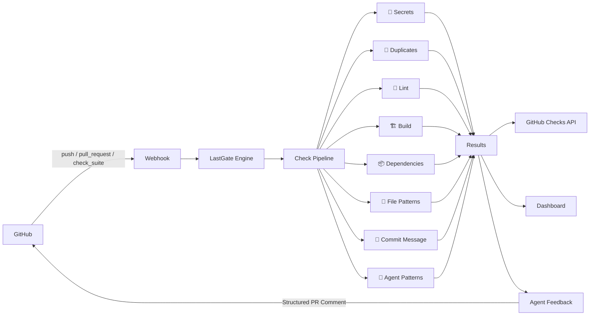

<p align="center">
  <h1 align="center">🛡️ LastGate</h1>
  <p align="center"><strong>Stop AI agents from breaking your repos</strong></p>
  <p align="center">An AI agent commit guardian that intercepts AI-generated code commits, runs safety checks, and reports results — before anything lands in your codebase.</p>
</p>

<p align="center">
  <a href="https://github.com/AaronCx/LastGate/actions"></a>
  <a href="https://www.npmjs.com/package/lastgate"></a>
  <a href="https://www.typescriptlang.org/"></a>
  <a href="https://bun.sh"></a>
  <a href="LICENSE"></a>
</p>

---


---

## Why LastGate?

AI coding agents (Copilot, Cursor, Claude Code, Devin, etc.) are writing more code than ever. But they commit unchecked code that can:

- **Leak secrets** — API keys, tokens, and credentials hardcoded into source files
- **Break builds** — type errors, lint failures, and missing dependencies
- **Introduce vulnerabilities** — outdated packages with known CVEs
- **Thrash on problems** — rewriting the same file over and over without progress
- **Ignore conventions** — skipping tests, violating file structure rules, malformed commit messages

**LastGate** sits between the AI agent and your repository. Every push and pull request triggers a pipeline of safety checks. Problems are caught, reported to GitHub Checks, and fed back to the agent as structured comments so it can self-correct.

No more reviewing AI slop. LastGate is the last gate before code lands.

---

## Features

| | Check | What It Does |
|---|---|---|
| 🔐 | **Secret Scanner** | Detects API keys, tokens, passwords, and high-entropy strings across 20+ regex patterns |
| 🔄 | **Duplicate Detector** | Finds copy-pasted code blocks and redundant logic introduced by agents |
| 🧹 | **Lint & Type Check** | Runs ESLint and TypeScript compiler checks against the diff |
| 🏗️ | **Build Verifier** | Ensures the project still builds after changes |
| 📦 | **Dependency Auditor** | Checks added/changed dependencies for known vulnerabilities |
| 📁 | **File Pattern Guard** | Enforces allowed/blocked file paths and naming conventions |
| 📝 | **Commit Message Validator** | Validates commit messages against conventional commit format |
| 🤖 | **Agent Pattern Analysis** | Detects thrashing, scope creep, config churn, and test skipping |

---

## Quick Start

Getting started takes under two minutes:

1. **Install the GitHub App** — Add LastGate to your repository from the GitHub Marketplace
2. **Add `.lastgate.yml`** — Drop a config file in your repo root (or use defaults)
3. **Done** — Every AI-generated push and PR is now guarded

```yaml
# .lastgate.yml
checks:
  secrets: { enabled: true, severity: error }
  duplicates: { enabled: true, severity: warning }
  lint: { enabled: true, severity: error }
  build: { enabled: true, severity: error }
  dependencies: { enabled: true, severity: warning }
  file_patterns: { enabled: true, severity: warning }
  commit_message: { enabled: true, severity: warning }
  agent_patterns: { enabled: true, severity: warning }
```

---

## CLI

Install the CLI globally:

```bash
bun install -g lastgate
```

### Commands

```bash
# Run all checks against the current working tree
lastgate check

# Initialize a .lastgate.yml config in your repo
lastgate init

# Authenticate with your LastGate account
lastgate login

# View check history for the current repo
lastgate history

# Run a specific check
lastgate check --only secrets

# Check a specific commit range
lastgate check --range HEAD~3..HEAD
```

---

## Check Types

| Check | Description | Default Severity |
|---|---|---|
| `secrets` | Scans for API keys, tokens, credentials, and high-entropy strings | `error` |
| `duplicates` | Detects duplicated code blocks within the diff | `warning` |
| `lint` | Runs ESLint and TypeScript type checking | `error` |
| `build` | Verifies the project builds without errors | `error` |
| `dependencies` | Audits new/changed dependencies for known CVEs | `warning` |
| `file_patterns` | Enforces file path allowlists and blocklists | `warning` |
| `commit_message` | Validates conventional commit message format | `warning` |
| `agent_patterns` | Detects AI agent behavioral anti-patterns | `warning` |

Severity levels:
- **`error`** — Fails the check run. PR cannot merge (if branch protection is enabled).
- **`warning`** — Passes with annotations. Visible but non-blocking.
- **`info`** — Informational only. Logged to the dashboard.

---

## Configuration

Create a `.lastgate.yml` file in your repository root:

```yaml
# .lastgate.yml — LastGate Configuration

# Global settings
version: 1
agent_feedback: true          # Post structured PR comments for agent self-correction
fail_on_error: true            # Fail the GitHub Check if any error-severity finding exists

# Check configuration
checks:
  secrets:
    enabled: true
    severity: error
    allow:
      - "**/*.example"         # Ignore example files
      - ".env.sample"
    custom_patterns:
      - name: "Internal Token"
        regex: "INTERNAL_[A-Z]+_TOKEN=['\"][^'\"]+['\"]"

  duplicates:
    enabled: true
    severity: warning
    min_lines: 6               # Minimum duplicate block size
    min_tokens: 50             # Minimum token count

  lint:
    enabled: true
    severity: error
    config: .eslintrc.json     # Custom ESLint config path

  build:
    enabled: true
    severity: error
    command: "bun run build"   # Custom build command

  dependencies:
    enabled: true
    severity: warning
    block_licenses:            # Block specific licenses
      - GPL-3.0
      - AGPL-3.0

  file_patterns:
    enabled: true
    severity: warning
    blocked:
      - "**/*.env"
      - "**/credentials.*"
      - "**/.secret*"
    required:
      - "src/**/*.test.ts"     # Require tests alongside source

  commit_message:
    enabled: true
    severity: warning
    pattern: "^(feat|fix|docs|style|refactor|test|chore)(\\(.+\\))?: .{1,72}$"

  agent_patterns:
    enabled: true
    severity: warning
    thrash_threshold: 3        # Flag if same file changed 3+ times in sequence
    scope_creep_files: 10      # Flag if PR touches more than 10 files
```

---

## Architecture



---

## Tech Stack

<p>
  
  
  
  
  
  
</p>

| Layer | Technology |
|---|---|
| **Web App** | Next.js 14 (App Router), React, Tailwind CSS |
| **Runtime** | Bun |
| **Language** | TypeScript (strict mode) |
| **Database** | Supabase (PostgreSQL + Auth + RLS) |
| **GitHub Integration** | GitHub App (Webhooks, Checks API, REST/GraphQL) |
| **CI/CD** | GitHub Actions |
| **CLI** | Bun-based CLI with Commander.js |

---

## Agent Feedback Loop

When LastGate finds issues in an AI-agent-generated PR, it doesn't just fail a check — it posts a **structured PR comment** designed for the agent to parse and act on.

```markdown
## 🛡️ LastGate Report

### Findings (3 errors, 1 warning)

| # | Severity | Check | File | Line | Description |
|---|----------|-------|------|------|-------------|
| 1 | 🔴 error | secrets | src/api/client.ts | 14 | Hardcoded API key detected (pattern: `AKIA[0-9A-Z]{16}`) |
| 2 | 🔴 error | lint | src/utils/parse.ts | 27 | TypeScript error TS2345: Argument of type 'string' is not assignable |
| 3 | 🔴 error | build | — | — | Build failed with exit code 1 |
| 4 | 🟡 warning | agent_patterns | — | — | Thrashing detected: `config.ts` modified 5 times in last 8 commits |

### Suggested Fixes
1. **secrets**: Move the API key to an environment variable. Use `process.env.AWS_ACCESS_KEY_ID` instead.
2. **lint**: Check the type signature of `parseInput()` — expected `number`, received `string`.
3. **build**: Run `bun run build` locally and fix compilation errors before pushing.
4. **agent_patterns**: Step back and reassess your approach to `config.ts` instead of repeatedly modifying it.
```

This format gives AI agents the structured context they need to fix issues autonomously, reducing review cycles.

---

## Contributing

See [CONTRIBUTING.md](CONTRIBUTING.md) for development setup, coding standards, and PR guidelines.

---

## License

[MIT](LICENSE) — Built by [Aaron Character](https://github.com/AaronCx)
