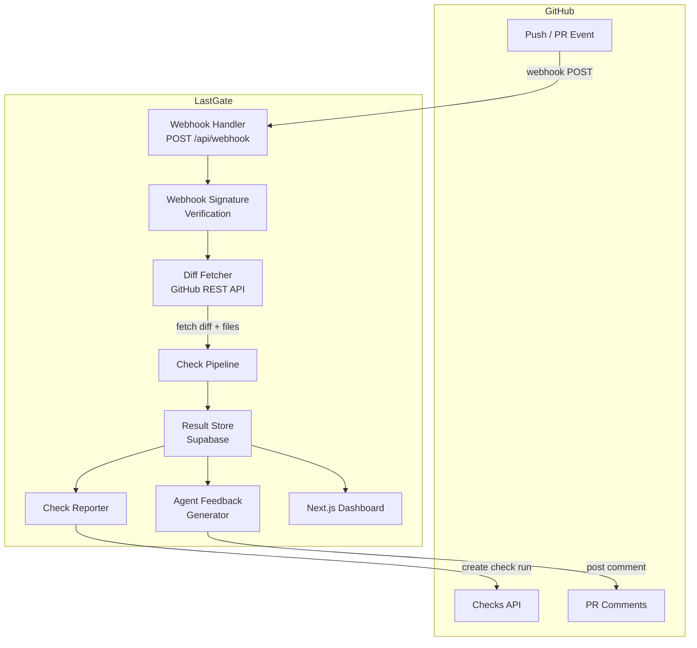

# Architecture

This document describes the system design of LastGate, including component responsibilities, data flow, database design, and security considerations.

---

## Overview

LastGate is a GitHub App that monitors AI-agent-generated commits. When a push or pull request event is received, it fetches the diff, runs a pipeline of safety checks, stores results, reports status via the GitHub Checks API, and optionally posts structured feedback as a PR comment.



---

## Components

### Web App (`apps/web/`)

The Next.js 14 application serving both the dashboard UI and the API routes.

| Concern | Location | Description |
|---|---|---|
| **Pages** | `app/` | App Router pages: overview, repo detail, PR review, agent activity, settings |
| **API Routes** | `app/api/` | Webhook handler, auth callbacks, dashboard data endpoints |
| **Components** | `components/` | React components for the dashboard UI |
| **Lib** | `lib/` | Supabase client, GitHub API helpers, auth utilities |

### Engine (`packages/engine/`)

The core check engine. Stateless and framework-agnostic — receives a diff and config, returns findings.

| Concern | Location | Description |
|---|---|---|
| **Checks** | `checks/` | Individual check implementations (one file per check type) |
| **Pipeline** | `pipeline/` | Orchestrates check execution, parallelization, and result aggregation |
| **Types** | `types/` | Shared TypeScript interfaces (`Finding`, `CheckResult`, `Config`, etc.) |

The pipeline runs checks in parallel where possible. Each check receives:
- The raw diff (unified diff format)
- The full file contents (for context-aware checks)
- The repository configuration (`.lastgate.yml` values)

Each check returns an array of `Finding` objects:

```typescript
interface Finding {
  check: CheckType;
  severity: "error" | "warning" | "info";
  file: string;
  line?: number;
  message: string;
  suggestion?: string;
}
```

### CLI (`packages/cli/`)

A Bun-based command-line tool for running checks locally.

| Command | Description |
|---|---|
| `lastgate check` | Run all checks against the working tree or a commit range |
| `lastgate init` | Generate a `.lastgate.yml` config file |
| `lastgate login` | Authenticate with the LastGate dashboard |
| `lastgate history` | View past check results for the current repo |

### GitHub Integration

Communication with GitHub happens through two channels:

1. **Inbound: Webhooks** — GitHub sends `push`, `pull_request`, and `check_suite` events to `POST /api/webhook`. The handler verifies the HMAC signature, identifies the installation, and triggers the check pipeline.

2. **Outbound: GitHub API** — LastGate uses the GitHub App installation token to:
   - Fetch commit diffs and file contents (Contents API)
   - Create and update check runs (Checks API)
   - Post PR comments with structured feedback (Issues/PR Comments API)

Authentication uses the GitHub App's private key to generate short-lived installation access tokens via JWT.

### Database (Supabase)

PostgreSQL database managed through Supabase with Row Level Security (RLS).

---

## Data Flow

A complete request lifecycle from webhook to result:

```
1. GitHub sends webhook event (push or pull_request)
       │
2. POST /api/webhook receives the payload
       │
3. Verify webhook signature (HMAC-SHA256)
       │
4. Parse event type and extract:
   - Repository (owner/name)
   - Commit SHA(s) or PR number
   - Installation ID
       │
5. Generate GitHub App installation token
       │
6. Fetch diff via GitHub API
   - For push: compare commits
   - For PR: get PR diff
       │
7. Load repository config (.lastgate.yml)
   - Fetch from repo via Contents API
   - Fall back to defaults if not present
       │
8. Run check pipeline
   - Initialize enabled checks
   - Execute checks in parallel
   - Aggregate findings
       │
9. Store results in Supabase
   - Insert check_run record
   - Insert finding records
   - Update repo stats
       │
10. Report to GitHub
    - Create/update check run via Checks API
    - Include annotations for file-level findings
       │
11. Post agent feedback (if enabled)
    - Format findings as structured markdown table
    - Post as PR comment (for PRs only)
```

---

## Database Design

### Tables

```
repositories
├── id (uuid, PK)
├── github_id (bigint, unique)
├── owner (text)
├── name (text)
├── installation_id (bigint)
├── config (jsonb)              # Cached .lastgate.yml
├── created_at (timestamptz)
└── updated_at (timestamptz)

check_runs
├── id (uuid, PK)
├── repository_id (uuid, FK → repositories)
├── commit_sha (text)
├── pr_number (integer, nullable)
├── event_type (text)           # push | pull_request | check_suite
├── status (text)               # pending | running | completed | failed
├── conclusion (text, nullable) # success | failure | neutral
├── findings_count (integer)
├── errors_count (integer)
├── warnings_count (integer)
├── duration_ms (integer)
├── created_at (timestamptz)
└── completed_at (timestamptz)

findings
├── id (uuid, PK)
├── check_run_id (uuid, FK → check_runs)
├── check_type (text)           # secrets | duplicates | lint | ...
├── severity (text)             # error | warning | info
├── file (text)
├── line (integer, nullable)
├── message (text)
├── suggestion (text, nullable)
├── metadata (jsonb)            # Check-specific data
└── created_at (timestamptz)

agent_activity
├── id (uuid, PK)
├── repository_id (uuid, FK → repositories)
├── pr_number (integer, nullable)
├── pattern_type (text)         # thrashing | scope_creep | config_churn | test_skip
├── details (jsonb)
├── commit_shas (text[])
└── detected_at (timestamptz)
```

### Row Level Security

All tables have RLS enabled. Access policies:

- **Public (anon) access**: None. All data requires authentication.
- **Authenticated users**: Can read repositories and check runs for repos they have access to (determined by GitHub App installation).
- **Service role**: Full access for the webhook handler and background jobs.

---

## Security Considerations

### Webhook Signature Verification

Every incoming webhook is verified using HMAC-SHA256:

```typescript
const signature = request.headers.get("x-hub-signature-256");
const payload = await request.text();
const expected = `sha256=${hmac("sha256", WEBHOOK_SECRET, payload)}`;

if (!timingSafeEqual(signature, expected)) {
  return new Response("Invalid signature", { status: 401 });
}
```

This prevents spoofed webhook deliveries.

### GitHub App Authentication

- The private key is stored as an environment variable, never committed to the repository.
- Installation access tokens are short-lived (1 hour) and scoped to the minimum required permissions.
- Tokens are generated per-request and not cached across requests.

### Secret Handling

- Supabase service role key is server-side only (`SUPABASE_SERVICE_ROLE_KEY` — no `NEXT_PUBLIC_` prefix).
- GitHub App private key is server-side only.
- Client-side code only has access to the Supabase anon key (scoped by RLS).

### Row Level Security (RLS)

All Supabase tables use RLS to enforce access control at the database level. Even if the API layer has a bug, the database will not return unauthorized data.

### Secret Scanner Safety

When the secret scanner detects a secret in a diff, the finding record stores:
- The pattern name (e.g., "AWS Access Key")
- The file and line number
- A redacted preview (first 4 and last 4 characters only)

The actual secret value is **never stored** in the database or logs.
